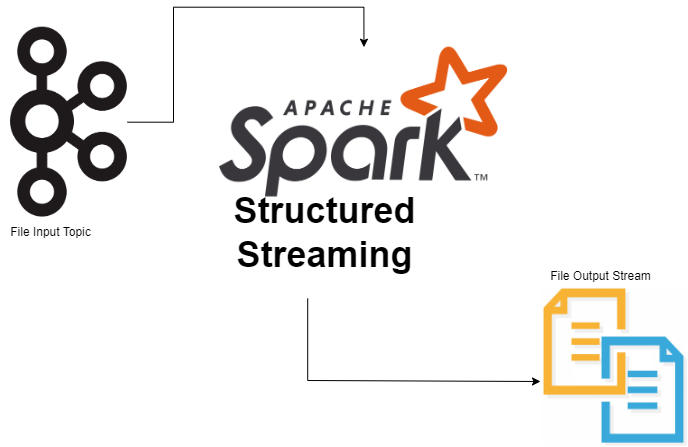

# Building solid streaming data pipelines with Apache Kafka and Spark Structured Streaming

📚 A course brought to you by the [Data Minded Academy].

## Context

These are the exercises used in the course *Data Pipeline Part 2 at DSTI*.  
The course has been developed by instructors at Data Minded. The
exercises are meant to be completed in the lexicographical order determined by
name of their parent folders. That is, exercises inside the folder `b_foo`
should be completed before those in `c_bar`, but both should come after those
of `a_foo_bar`.

## Course objectives

- Introduce good data engineering practices.
- Illustrate modular and easily testable data transformation pipelines using
  PySpark.
- Illustrate PySpark concepts, like lazy evaluation, caching & partitioning.
  Not limited to these three though.

## Intended audience

- People working with (Py)Spark Structured Streaming and Apache Kafka or soon to be working with it.
- Familiar with Python functions, variables and the container data types of
  `list`, `tuple`, `dict`, and `set`.

## Approach

Lecturer first sets the foundations right for Python development and
gradually builds up to Apache Kafka and Spark Structured Streaming data pipelines.

There is a high degree of participation expected from the students: they
will need to write code themselves and reason on topics, so that they can
better retain the knowledge.

Note: this course is not about writing the best streaming pipelines possible. There are
many ways to skin a cat, in this course we show one (or sometimes a few), which
should be suitable for the level of the participants.

## Getting started with Spark Structured Streaming

## Spark Set Up on Windows
Follow these instructions to set up JDK 11, Hadoop WinUtils, Spark binaries and environment 
variables on Windows/x64 System: [Click Here](https://app.tango.us/app/workflow/Setting-up-JDK--Hadoop-WinUtils--Spark-binaries-and-environment-variables-on-Windows-x64-System-ce23bd438117424c87009b2ac1fc82bd) 


## Getting started with Spark Structured Streaming 

Spark Structured Streaming hands-on exercises

### Prerequisites
Open a new terminal and make sure you're in the `kafka_spark_streaming` directory. Then, run:

```bash
pip install -r requirements.txt
```

This will install any dependencies you might need to run this project in your virtual environment.

You will also need to download [nmap](https://nmap.org/download.html) for Windows.

To use `nmap`, start a new terminal and type `ncat -lk 9999` to start the listener. 
You can send text to port 9999 just by typing in the same terminal.


## Exercises

### Count the number of words in real-time
Check out [word_count.py](exercises/a_spark_streaming_socket_source/word_count.py) and implement the pure
python function `transform`. But first, make sure you understand the code and what it does.
You will start a new terminal with an `ncat` listener as explained before. 
Count how many times each word appears in real-time.

Test your function with the [test_word_count.py](tests/test_word_count.py) test file.


### Transform nested JSON files to flattened JSON files
Check out [file_streaming.py](exercises/b_spark_streaming_file_source/file_streaming.py) and implement the pure
python function `transform`. But first, make sure you understand the code and what it does.
Have a look at the JSON files in `resources > invoices-json`.
You can see that there are nested fields. We want to flatten those files so that there are no 
nested fields in the final JSON files.

### BONUS 1
Create a test file to test your function from exercise 2 (**HINT**: The invoice schema is already written in the `utils > invoice_schema.py`).

### BONUS 2
Repeat the previous exercise but using the parquet files format instead of JSON. Adapt anything you need in your code

### BONUS 3
Translate the exercises from the first day to use Spark Structured Streaming


## Getting started with Apache Kafka

Apache Kafka hands-on exercises mixed with Spark Structured Streaming

## Apache Kafka Set Up on Windows
Follow these instructions to set up Apache Kafka binaries and environment 
variables on Windows/x64 System: [Click Here](https://app.tango.us/app/workflow/Download-and-Configure-Apache-Kafka-on-Windows-x64-System-474eb2506acd494ebd5c94686ea610c2) 

**IMPORTANT: Add Spark SQL Kafka package to your Spark Defaults** `C:\spark3\conf` folder, `spark-defaults.conf` file:

spark.jars.packages                org.apache.spark:spark-sql-kafka-0-10_2.12:3.2.4


### Prerequisites (if not already done)
Open a new terminal and make sure you're in the `kafka_spark_streaming` directory. Then, run:

```bash
pip install -r requirements.txt
```

This will install any dependencies you might need to run this project in your virtual environment.


## Exercises

### Transform nested JSON files to flattened JSON files
Read the invoices, that are being sent through kafka in real-time, with Spark Structured Streaming and flatten the nested JSONs

Check out [file_streaming.py](exercises/c_spark_streaming_kafka_source/file_streaming.py) and implement the pure
python function `transform`. But first, make sure you understand the code and what it does.




### Send Notification Record to Kafka Topic
1. Read Invoices from Kafka Topic
2. Create Notification Record (with 3 fields):
   3. {"CustomerCardNo": "243252", "TotalAmount": 11115.0, "EarnedLoyaltyPoints": 2222.6}
   4. The  column named `EarnedLoyaltyPoints` is a new column that you have to create, it is 20% of the `TotalAmount` column
3. Send Notification Record to Kafka Topic
   4. Kafka Topic receives data as key-value pair, send the `invoice number` as a **key** and the `notification record` as a **value**

Check out [notification.py](exercises/c_spark_streaming_kafka_source/notification.py) and implement the pure
python functions `transform` and `get_notification_dataframe`. But first, make sure you understand the code and what it does.


### Multi query
Let's do exercise 1 and exercise 2 at once. So, we'll be reading from the invoice topic and we'll write to the outpu
files at the same time we'll write to the notifications topic. This will save some execution time and resources since
we'll only need to read from Kafka once and we can compute the transformations at the same time.

Check out [multi_query.py](exercises/c_spark_streaming_kafka_source/multi_query.py) and implement the pure
python functions `transform_flatten_reports` and `get_notification_df_transformed`. 
But first, make sure you understand the code and what it does.


### BONUS
Create a test file to test your functions.


## Useful information:
In the `resources` folder you will find all the input data (JSON, CSV, parquet files) you need to do the exercises.

The `utils` folder contains the `catalog.py` file which was also used during the first class with the Spark DataFrame API
but this time adapted for Spark Structured Streaming. `invoice_schema.py` is the invoice schema of the messages written
to the kafka topic. Under `kafka_scripts` you will find all the necessary scripts to start kafka (zookeeper, server, 
create topics, start producer, start consumer). In `kafka_commons.py` you will find common methods for all kafka related
exercises.

[Data Minded Academy]: https://www.dataminded.academy/
